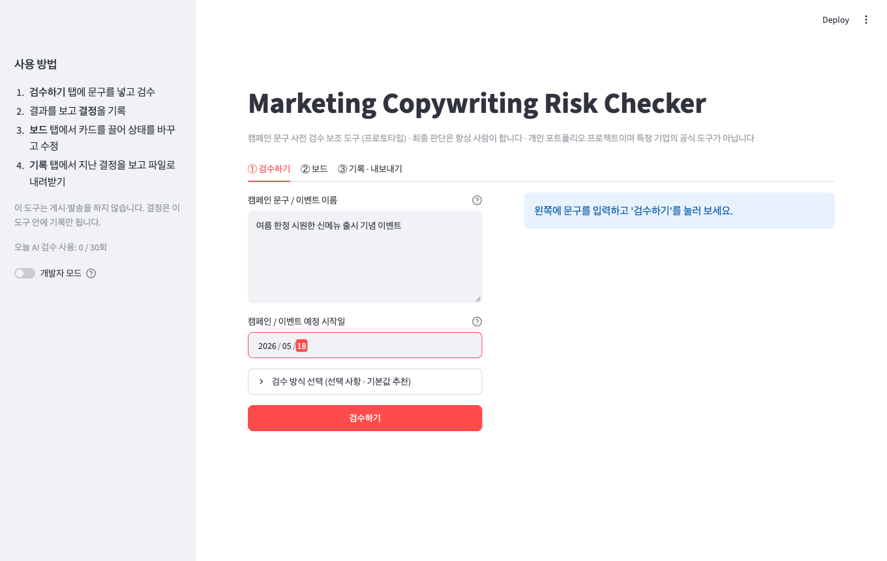
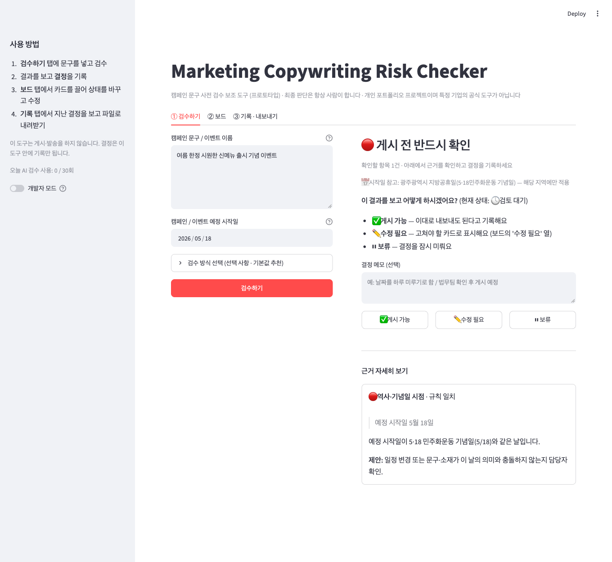
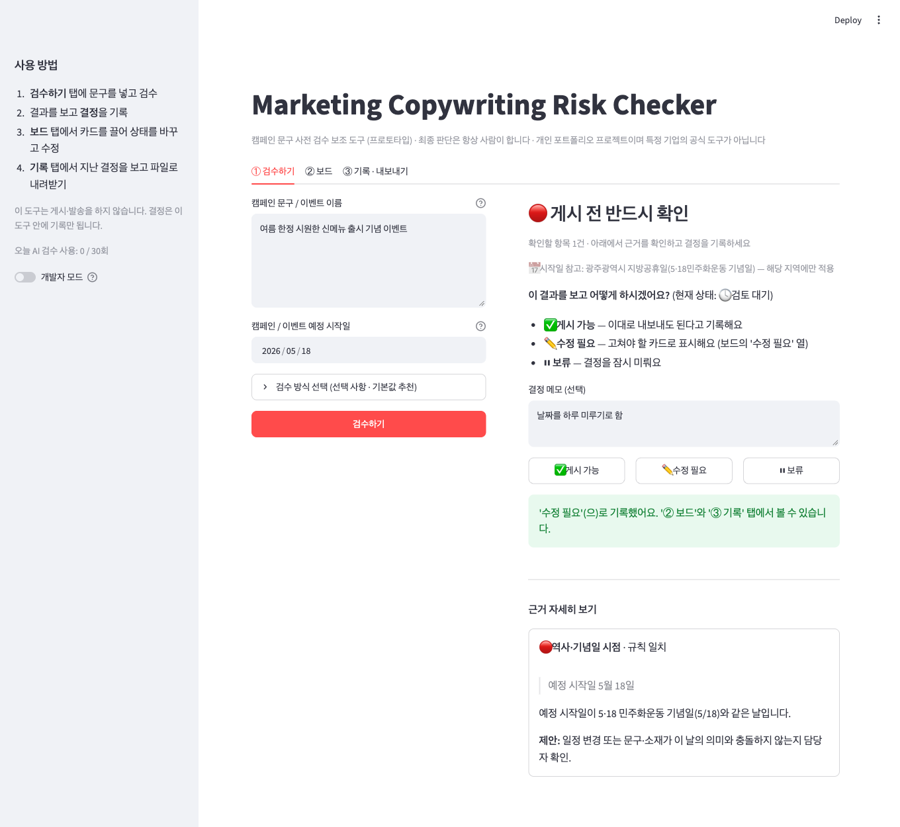
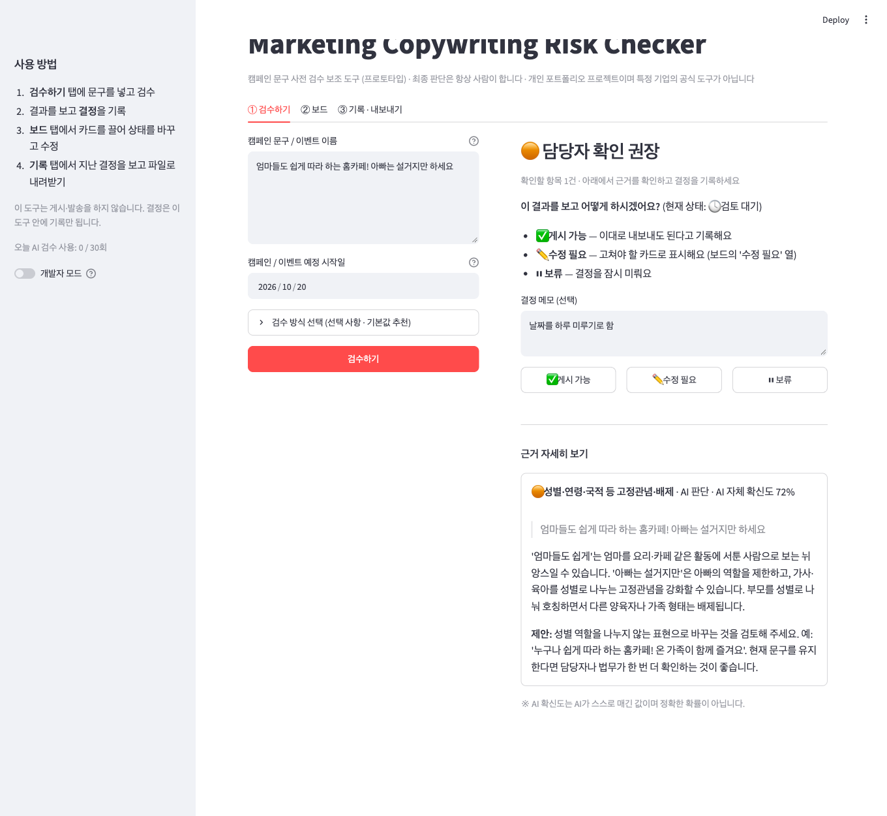
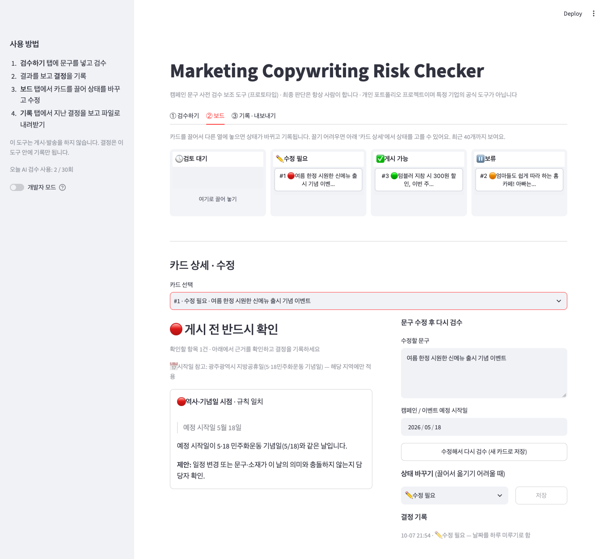
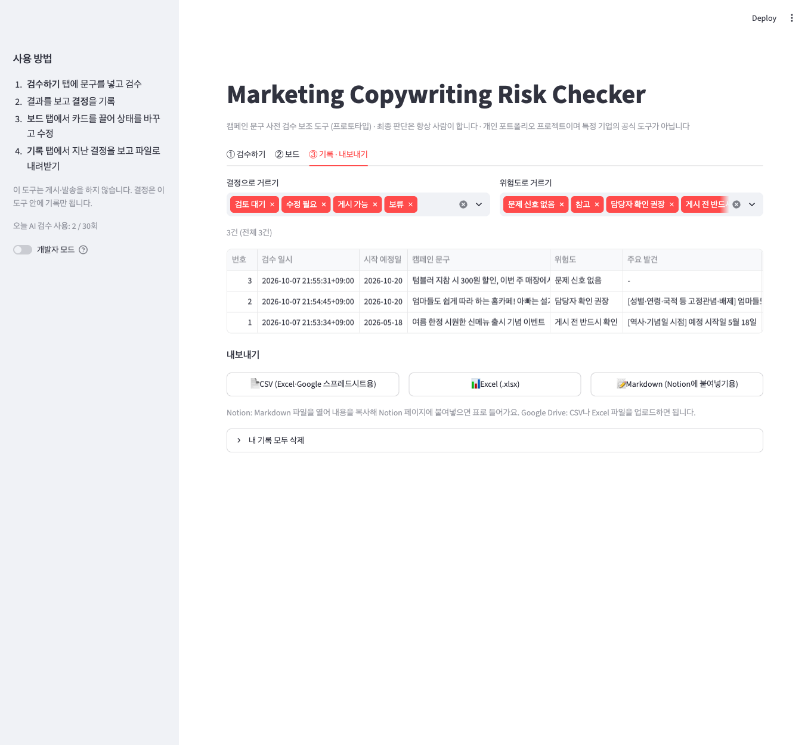

# Marketing Copywriting Risk Checker: Catch PR Risks Before You Publish

> A prototype that checks marketing copy before it goes live, using rules plus an LLM, with a person making the final call. Side project. Status: runs locally, not deployed, no real users. The interface is in Korean.

## Problem
A marketing post can go out on a memorial day, or contain a claim or phrase that needs a second look. Teams usually catch this from memory and by asking around, and a person reviewing alone can miss things because of their own bias. A recent example is the Starbucks Korea "Tank Day" promotion controversy, the kind of public-relations incident a pre-publish check is meant to help catch.

I built this to apply the rule-based + LLM cascade method from my thesis to a practical tool. The tool helps marketers check copy before they publish it. AI assists the judgment, and a person makes the final decision or edit. The aim is to lower the chance of a PR incident. This prototype has not been tested on real campaigns, so it does not show that yet. It also keeps a record of who decided what.

## My role
I designed and built it alone: the rules, the LLM prompt, the review screen, the audit log, the test set and the evaluation. I used Claude Code to help write and review code. The design decisions and the labeling of every test case are mine.

## Data
- A 2026 to 2028 calendar of memorial days and public holidays (`data/holidays_ko.yaml`), collected from public pages (Namuwiki's public holiday article and the Korean public holidays act). It is **not yet verified** against official sources and does not include temporary closure days.
- **48** synthetic marketing sentences that I wrote (`tests/`). They are not real ads or real events.

## Tools
Python, Streamlit, SQLite, Claude API (structured output), pytest (**27** unit tests).

## Process
- Rules layer: memorial-day calendar, word list and superlative claims. Fast and easy to explain.
- LLM layer: finds meaning-level risks the rules miss (stereotypes, discrimination, health claims). It only flags situations that need a person to look; it does not judge politics.
- Cascade: if the rules are highly confident, the LLM is skipped. If the LLM fails, the result falls back to the rules and is marked "needs human check".
- Human review: proceed, revise or hold, with a note. Nothing is ever auto-approved. Every decision goes to an audit log and can be exported to CSV, Excel or Markdown. A drag-and-drop board tracks status.
- Safety checks added after review: random delimiters against prompt injection, a 30-second API timeout, spreadsheet-formula protection on exports, a daily AI usage cap, and per-user workspaces.

## Screenshots and how to use it
The interface is in Korean. The sample copy below is invented (it comes from my synthetic test cases), not real advertising.

**Step 1. Enter the copy and the planned start date.** The default mode is "Recommended" (rules first, AI only where the rules cannot judge). A faster rules-only mode and a slower AI-reads-everything mode are in the expander.



**Step 2. Read the result.** Here the rules found that the start date, May 18, is a memorial day, so the banner is red ("Check before publishing"). The card below the banner shows the quoted evidence, the reason and a suggested next step.



**Step 3. Record a decision.** Choose "OK to publish", "Needs revision" or "On hold", with an optional note. Nothing is ever approved automatically.



**When the rules cannot judge, the AI reads the copy.** This example is flagged as a gender stereotype. The AI quotes the phrase, explains the reason, suggests a rewrite and shows its own confidence (72%). That number is the model's self-rating, not a true probability.



**Step 4. Use the board.** Every check is a card in a column by decision. Drag a card to another column to change its status. You can also edit the text and check it again as a new card.



**Step 5. Review and export.** The log tab lists every check with filters. Export to CSV, Excel or Markdown (to paste into Notion).



## Evaluation (synthetic cases, small sample)
I split the 48 cases into **24** for development and **24** for a blind test. I locked the test file with a SHA-256 hash before running it and ran each mode twice. Details are in [`docs/evaluation.md`](docs/evaluation.md).

| Mode | Precision [95% CI] | Recall [95% CI] | Same verdict on both runs | LLM calls |
|---|---|---|---|---|
| Rules only | 1.00 [0.72–1.00] | 0.71 [0.45–0.88] | 100% | 0 |
| LLM only | 1.00 [0.74–1.00] | 0.79 [0.52–0.92] | 88% | 24 |
| **Cascade** | **1.00 [0.78–1.00]** | **1.00 [0.78–1.00]** | **100%** | **18** |

## Insights
- The two layers make different mistakes. Rules missed **4** cases that need meaning (stereotypes, discrimination, health claims). The LLM alone missed **3** cases that need calendar or election knowledge. Together they missed none on these 24 cases.
- The LLM alone gave a different verdict on **3 of 24** inputs when run twice. Rules and cascade never did.
- **This does not prove the cascade is better.** No pair of modes differs significantly (McNemar exact test, p = 0.125 to 1.0), and the confidence intervals are wide.

## Business impact
This prototype has no users, so there is no measured impact. To measure it, I would track how many flagged items reviewers confirm as real (precision on real copy), how many false alarms they report, and how much review time the check saves.

## Limitations
- I wrote both the labels and the rules, so the results lean optimistic.
- 24 test cases are too few to claim one mode beats another; they only show direction.
- The cases are synthetic and do not represent real marketing copy.
- The calendar is not yet checked against official sources.

## Future work
1. Independent labeling. Ask at least two reviewers to label the cases without seeing my labels, then report Cohen's kappa. Policy-dependent cases (for example a post that mentions a national holiday) may get different labels depending on team policy.
2. A fresh blind set. The current test set is used up. Write 24 or more new cases, lock them with a hash, and run them once.
3. Real copy and real feedback. Re-measure precision on a sample of real marketing copy and on false-positive reports from users.
4. Verify the calendar. Check every date against an official source and mark it verified. Add temporary closure days.
5. Version B, a demand-signal dashboard. Combine Naver DataLab search trends, weather and holidays to see how events relate to demand. Search volume is only a proxy for demand, not revenue.
6. Before any public release. Keep the API key on the server only, add rate limits and a clear "unofficial, assistive tool" label, store no personal data beyond the input, and test the drag-and-drop board on touch devices.

## Challenges & learnings
- The LLM once called an election-linked promotion harmless. That led me to add a rule. I removed the case from the evaluation so it would not inflate the score.
- Keeping a locked test set and reporting the result even when it is not flattering taught me the most. It made me careful about what the numbers can and cannot say.

## How to run
The Python package is named `preflight` (the project's earlier name), so you will see that name in the code.

```bash
python3 -m venv .venv && source .venv/bin/activate
pip install -r requirements.txt
cp .env.example .env        # then put your Anthropic API key in .env
streamlit run streamlit_app.py
python -m pytest tests/test_units.py     # unit tests, no API calls
python tests/run_eval.py dev             # evaluation on the development cases (calls the API)
```
Without an API key the rules layer still works; the LLM layer falls back to the rules and marks the result "needs human check".

## Disclaimer
Personal portfolio project. It is not an official tool of any company, and it only assists a human reviewer. Test sentences are invented, and the calendar and word list have not been checked against official sources.

## License
MIT. See `LICENSE`. The holiday dates are factual and were collected from public pages; check them before relying on them.
